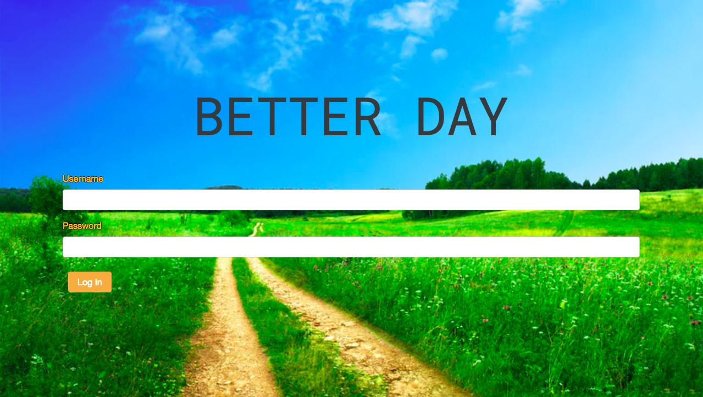
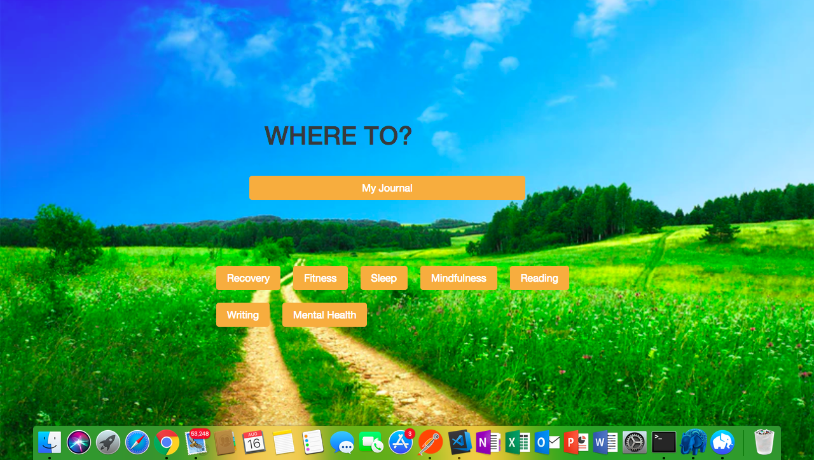
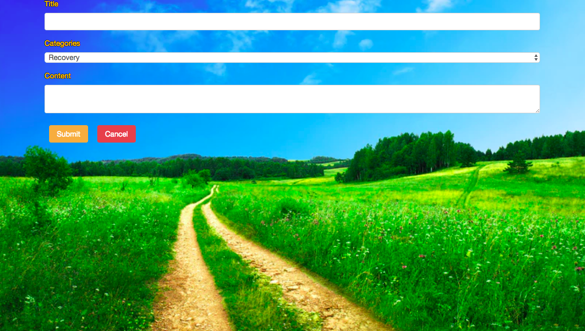

# Better Day

Better Day is an online resource that allows you to keep a journal as well as anonymously post and read posts submitted by people who are working through some of the same things you can relate to.

## Team Members

* Josh Brown

## Tools

* Javascript
* node.js
* Express
* PostgreSQL
* Bootstrap
* React
* React router
* Redux
* Redux-form
* Redux
* Redux thunk
* lodash

## Where to find it

Project is currently unhosted but the full repo for the front end can be found here: https://github.com/JoshRBrown/Better_Day.

The back end for the project can be found here:
https://github.com/JoshRBrown/Better_Day_Back. 

## Walkthrough

### Login Page

* The first page the user sees when they visit the site

### Home Page

* After logging in the user will be taken to the table of contents. Here they can navigate to their own journal entries or browse other entries based on categories they can relate to.

### Writing an entry

* Here the user can write their own entry.

## Future Additions

#### Enable commenting on other user's entries

#### Give the user the option to hide their posts or show their identity
